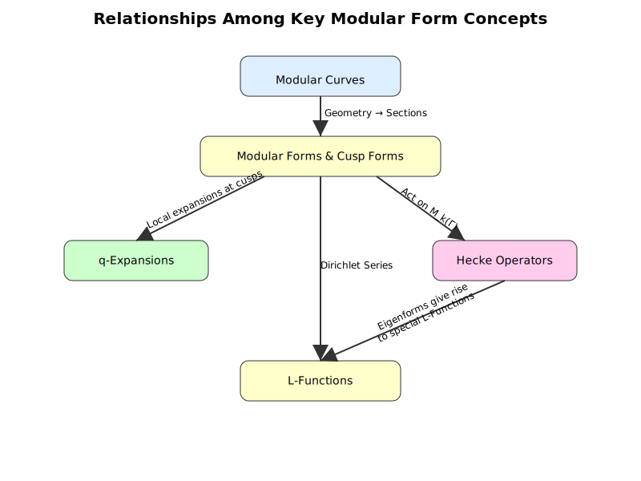

# 6. 古典的モジュラー形式

## はじめに：なぜモジュラー形式を学ぶのか？

モジュラー形式は、数論、複素解析、代数幾何学、表現論が交差する驚くべき場所に位置しています。その研究は数学におけるいくつもの歴史的偉業をもたらしてきました。たとえば：

* **フェルマーの最終定理**（Andrew Wiles による証明）\
  これは楕円曲線のモジュラー性（Shimura–Taniyama 予想）に本質的に依拠しています。
* **L 関数との関連性**\
  リーマンのゼータ関数やディリクレの L 関数などと結びつき、モジュラー形式のフーリエ係数と数体の算術との深い関係を明らかにします。
* **ラングランズ計画**\
  幾何や数論など多彩な分野を「保型形式」と「ガロワ表現」という観点から統合しようとする巨大なネットワーク（予想と定理群）であり、モジュラー形式はその原型となる $$\mathrm{GL}_2$$ の保型形式として重要な例を提供します。

歴史的に、モジュラー形式の研究は次のような流れで発展してきました。

1. **楕円積分と楕円関数（19世紀）**\
   Abel や Jacobi などの数学者は、複素平面上で周期を 2 つもつ有理型関数である楕円関数を研究しました。これらの関数には、のちに「モジュラー変換則」と呼ばれる対称性があることが分かり、モジュラー形式への道を開いたのです。
2.  **ラマヌジャンによる** $$\boldsymbol{\tau}$$ **関数の研究**\
    Srinivasa Ramanujan は次のように定義される関数

    $$
    \Delta(\tau) \;=\; q \,\prod_{n=1}^{\infty} \bigl(1 - q^n\bigr)^{24} 
      \quad (\text{ただし } q = e^{2\pi i \tau})
    $$

    を導入し、そのフーリエ係数 $$\tau(n)$$ を研究しました。\
    この $$\Delta(\tau)$$ は重さ $$12$$ の**尖点形式**(cusp form) であり、整数や分割数（partition）などの深い性質を符号化しています。
3.  **古典的な数論問題**\
    たとえば **アイゼンシュタイン級数**

    $$
    E_k(\tau) 
      \;=\; 1 - \frac{2k}{B_k}\,\sum_{n=1}^{\infty} \sigma_{k-1}(n)\,q^n,
      \quad \sigma_{k-1}(n) = \sum_{d\mid n} d^{\,k-1},
    $$

    はゼータ関数や L 関数の特別値と直接結びついています。これらの級数が $$\mathrm{SL}_2(\mathbf{Z})$$ の作用下で示す変換性質によって、解析的整数論の自然な対象として現れました。
4. **楕円曲線の幾何**\
   $$\Gamma \subset \mathrm{SL}_2(\mathbf{Z})$$ を用いて上半平面 $$\mathcal{H}$$ を剰余類で割った商 $$\Gamma\backslash \mathcal{H}$$ を射影的に完成すると、代数曲線 $$X(\Gamma)$$ が得られます。特に $$X_0(N)$$ はレベル $$N$$ 構造をもつ楕円曲線をパラメータ化し、そこからモジュラー形式がこれらの曲線上の線束の切断として自然に生じることが明らかになります。

以上をまとめると、**モジュラー形式を学ぶ**ことで次のような多方面にわたるツールを得ることができます。

* **複素解析**\
  強力な変換則をもつ正則関数に関する理解が深まる。
* **代数幾何学**\
  楕円曲線やモジュラー曲線を幾何学的に把握する視点を得る。
* **数論**\
  モジュラー形式のフーリエ係数には、整数や類群、ガロワ表現などの算術的情報がエンコードされている。
* **ラングランズ計画**\
  ガロワ表現と保型表現の深い対応関係を象徴する代表例として、モジュラー形式はラングランズ的視点で理解を深めるうえで不可欠な手がかりとなる。

以下のセクションでは、これらの概念を体系的に展開していきます。まずは**古典的なモジュラー形式**の定義から始め、続いてそれらに付随する L 関数へと進みます。これらは現代のラングランズ的視点においても非常に重要な柱となっています。

<figure><figcaption></figcaption></figure>

***

## 6.1. モジュラー形式の定義と例

### **6.1.1. モジュラー群と基本的な設定**

*   **上半平面**\
    上半平面を

    $$
    \mathcal{H} \;=\; \{\tau \in \mathbf{C} \;:\; \Im(\tau) > 0\}
    $$

    と定義する。
*   $$\mathrm{SL}_2(\mathbf{Z})$$ **の作用**\
    $$\mathrm{SL}_2(\mathbf{Z})$$ の元

    $$
    \gamma \;=\; \begin{pmatrix} a & b \\ c & d \end{pmatrix}
      \quad (\text{すなわち } a,b,c,d \in \mathbf{Z} \text{ かつ } ad - bc = 1)
    $$

    は、$$\mathcal{H}$$ 上の点 $$\tau$$ に対して次のように作用する：

    $$
    \gamma \cdot \tau
      \;=\;
      \frac{a\tau + b}{c\tau + d}.
    $$
*   **重み** $$k$$ **のスラッシュ演算子 (slash operator)**\
    関数 $$f:\mathcal{H} \to \mathbf{C}$$ に対し、重み $$k$$ のスラッシュ演算子は

    $$
    (f \!\mid_k \gamma)(\tau)
      \;=\;
      (c\tau + d)^{-k}\, f\!\bigl(\gamma \cdot \tau \bigr)
    $$

    と定義される。これは、$$\mathrm{SL}_2(\mathbf{Z})$$ の作用に対する関数の変換性を扱う際に便利な記法である。

### **6.1.2. 重み** $$k$$ **のモジュラー形式**

重み $$k$$（通常は非負整数、あるいは複素数の場合もある）をもつ **モジュラー形式** とは、$$\mathcal{H}$$ 上で定義された正則関数 $$f:\mathcal{H} \to \mathbf{C}$$ で、以下の2つの条件を満たすものである（$$\mathrm{SL}_2(\mathbf{Z})$$ に関して）:

1.  **変換性 (Transformation Property)**

    $$
    f\!\bigl(\gamma \cdot \tau\bigr)
      \;=\;
      (c\tau + d)^k \, f(\tau)
      \quad
      \bigl(\gamma = \begin{pmatrix} a & b \\ c & d \end{pmatrix} \in SL_2(\mathbf{Z}),\;\tau \in \mathcal{H}\bigr).
    $$
2.  **尖点での正則性 (Growth Condition)**\
    $$\tau \to i\infty$$（すなわち $$q = e^{2\pi i \tau} \to 0$$）の極限で「多項式程度の成長」以下となるように要求される。具体的には、

    $$
    f(\tau)
      \;=\;
      \sum_{n=0}^{\infty} a_n\, q^n
      \quad (q = e^{2\pi i \tau})
    $$

    という $$q$$-展開を考えたときに、負の冪の項が存在せず（つまり $$q = 0$$ で極をもたない）、$$f$$ は $$\infty$$（尖点）で正則になるように要求される。

同様の定義を $$\mathrm{SL}_2(\mathbf{Z})$$ の部分群 $$\Gamma$$（たとえば **合同部分群** $$\Gamma_0(N)$$、$$\Gamma_1(N)$$ など）に対して行うとき、$$\Gamma$$ **上のモジュラー形式** と呼ぶ。

### **6.1.3. 尖点形式 (Cusp Forms)**

$$\mathrm{SL}_2(\mathbf{Z})$$ における重み $$k$$ の **尖点形式 (cusp form)** とは、上の定義のモジュラー形式 $$f(\tau)$$ のうち、$$q$$-展開で定数項が消えているもの、すなわち

$$
f(\tau)
  \;=\;
  \sum_{n=1}^{\infty} a_n \, q^n
$$

となるような形式である。言い換えると、尖点上で消えている（vanish）という条件を満たすものでもある。尖点形式はより強い消滅条件を課すため、そこから得られる $$L$$-関数などはより深い算術的性質をもつことが多い。

### **6.1.4. モジュラー形式の例**

1.  **アイゼンシュタイン級数 (Eisenstein series)**\
    $$e(s) > 1$$ のとき、

    $$
    E_s(\tau)
      \;=\;
      \sum_{\substack{(m,n)=1 \\ (m,n)\neq (0,0)}}
      \frac{1}{(m\tau + n)^s}
    $$

    と定義される。$$k \ge 2$$ の正整数の場合に $$s = k$$ を代入すると（正規化を施したうえで）重み $$k$$ のアイゼンシュタイン級数を得る：

    $$
    E_k(\tau)
      \;=\;
      1 \;-\; \frac{2k}{B_k} \sum_{n=1}^{\infty} \sigma_{k-1}(n)\, q^n,
    $$

    ただし $$\sigma_{k-1}(n) = \sum_{d|n} d^{k-1}$$、$$B_k$$ は $$k$$ 次ベルヌーイ数である。アイゼンシュタイン級数は正則モジュラー形式の代表例であり、理論の重要な構成要素となる。
2.  **デデキントのイータ関数 (Dedekind eta function)**

    $$
    \eta(\tau)
      \;=\;
      q^{1/24} \prod_{n=1}^{\infty} (1 - q^n),
      \quad q = e^{2\pi i \tau}
    $$

    は、$$\mathrm{SL}_2(\mathbf{Z})$$ のある種の 2重被覆（メタプレクティック群）上の重み $$1/2$$ のモジュラー形式となる。これの24乗は、他のモジュラー形式（たとえば $$\Delta(\tau)$$）を構成する際に頻出する。
3.  **ディスクリミナント函数** $$\Delta(\tau)$$

    $$
    \Delta(\tau)
      \;=\;
      (2\pi)^{12} \,\eta(\tau)^{24}
      \;=\;
      q \prod_{n=1}^{\infty} (1-q^n)^{24}
    $$

    は、$$\mathrm{SL}_2(\mathbf{Z})$$ 上の重み12の尖点形式である。その零点や因数分解の性質は数論において非常に重要な帰結をもたらす。

***

## 6.2. モジュラー曲線と合同部分群

### **6.2.1. 合同部分群**

$$\mathrm{SL}_2(\mathbf{Z})$$ の **合同部分群 (congruence subgroup)** とは、ある自然数 $$N$$ に対して

$$
\Gamma(N)
  \;=\;
  \Bigl\{\gamma \in \mathrm{SL}_2(\mathbf{Z})
  : 
  \gamma \equiv \begin{pmatrix}1 & 0\\ 0 & 1\end{pmatrix}
  \pmod{N}
  \Bigr\}
$$

を含む部分群のことである。代表的な例として以下が挙げられる：

1.  $$\Gamma_0(N)$$

    $$
    \Gamma_0(N)
      \;=\;
      \Bigl\{
        \begin{pmatrix} a & b\\ c & d\end{pmatrix}
        \in \mathrm{SL}_2(\mathbf{Z})
        :\;
        c \equiv 0 \pmod{N}
      \Bigr\}.
    $$
2.  $$\Gamma_1(N)$$

    $$
    \Gamma_1(N)
      \;=\;
      \Bigl\{
        \begin{pmatrix} a & b\\ c & d\end{pmatrix}
        \in \mathrm{SL}_2(\mathbf{Z})
        :\;
        c \equiv 0 \pmod{N},\,
        a \equiv d \equiv 1 \pmod{N}
      \Bigr\}.
    $$

### **6.2.2. モジュラー曲線**

*   **合同部分群による商**\
    合同部分群 $$\Gamma$$ に対して、

    $$
    X(\Gamma)
      \;=\;
      \Gamma \backslash \Bigl(\mathcal{H} \cup \{\text{尖点（cusps）}\}\Bigr)
    $$

    というリーマン面を考える。これを **モジュラー曲線 (modular curve)** と呼び、$$\Gamma$$ が合同部分群であるとき、このリーマン面は代数曲線としても定義できる。たとえば、

    $$
    X_0(N)
      \;=\;
      \Gamma_0(N)
      \backslash
      \Bigl(\mathcal{H} \cup \{\text{cusps}\}\Bigr)
    $$

    は代表例である。
* **幾何学的解釈**\
  $$X_0(N)$$ は「位数 $$N$$ の巡回部分群を伴う（付随させた）楕円曲線」をパラメータ化する空間として解釈できる。この幾何学的視点は、モジュラー形式の算術的性質を理解するうえで非常に重要である。

### **6.2.3. コンパクト化と尖点**

$$X(\Gamma)$$ をコンパクト化するには、有理数全体 $$\mathbf{Q}\cup \{\infty\}$$ の $$\Gamma$$-軌道に対応する有限個の **尖点（cusp）** を付け加える。各尖点において、モジュラー形式が正則あるいは弱い特異性しかもたないように拡張する（尖点での成長条件を確認するのは、$$\tau \to i\infty$$ での振る舞いを調べるのと同じ要領で行われる）。

***

## 6.3. フーリエ展開と $$q$$-展開

### **6.3.1. 無限遠点での** $$q$$**-展開**

$$f(\tau)$$ が $$\infty$$ で正則である、という表現は $$\tau \to i\infty$$ での振る舞いが正則であることを意味する。これを捉えるために

$$
q \;=\; e^{2\pi i \tau}
$$

という置き換えを行う。重み $$k$$ の $$\mathrm{SL}_2(\mathbf{Z})$$ 上のモジュラー形式 $$f(\tau)$$ には、次のように負の冪をもたない（Laurent ではなく通常の冪級数としての）$$q$$-展開が要求される：

$$
f(\tau)
  \;=\;
  \sum_{n=0}^\infty a_n\,q^n, 
  \quad
  a_n \in \mathbf{C}.
$$

ここで $$a_0$$ は **定数項 (constant term)** と呼ばれる。

### **6.3.2. 他の尖点における局所的な** $$q$$**-展開**

合同部分群 $$\Gamma$$ とその尖点 $$s$$ を一つ固定する。適切な $$\sigma \in \mathrm{SL}_2(\mathbf{Z})$$ を選ぶことで、その尖点 $$s$$ を $$\infty$$ に送ることができる（$$\tau' = \sigma \cdot \tau$$ とおく）。すると、$$q' = e^{2\pi i \tau'}$$ を考えることで、$$\Gamma$$ 上のモジュラー形式はそれぞれの尖点 $$s$$ についても正則（あるいは尖点的消滅）を満たすような $$q'$$-展開をもつ。

***

## 6.4. ヘッケ作用素 (Hecke Operators) とその固有形式

### **6.4.1. ヘッケ作用素の定義**

ヘッケ作用素とは、モジュラー形式（あるいは尖点形式）の空間上に作用する線型作用素で、深い算術的性質を反映している。正の整数 $$n$$ に対する **ヘッケ作用素** $$T_n$$ は、次の二重剰余類により定義される：

$$
T_n
  \;=\;
  \Gamma_0(N)\,\begin{pmatrix}1 & 0 \\ 0 & n\end{pmatrix}\,\Gamma_0(N),
$$

これを重み $$k$$ の形式 $$f(\tau)$$ に作用させるとき、しばしば

$$
(T_n f)(\tau)
  \;=\;
  n^{k-1}
  \sum_{\substack{ad=n \\ 0 \leq b < d}}
  (f \!\mid_k \gamma_{a,b,d})(\tau),
  \quad
  \gamma_{a,b,d} = \begin{pmatrix} a & b \\ 0 & d\end{pmatrix}
$$

のように書かれる（正規化や部分群により定義は多少異なる）。

### **6.4.2. フーリエ級数へのヘッケ作用素の作用**

特に素数 $$p$$ に対するヘッケ作用素 $$T_p$$ のフーリエ展開への作用は分かりやすい。もし

$$
f(\tau)
  \;=\;
  \sum_{n=0}^{\infty} a_n\, q^n
$$

ならば、

$$
(T_p f)(\tau)
  \;=\;
  \sum_{n=0}^{\infty}
  \bigl(a_{pn} + p^{k-1} a_{n/p}\bigr)\, q^n
$$

となる（ただし $$\displaystyle a_{n/p}$$ は $$p \mid n$$ でない場合は 0 とみなす）。合成数 $$n$$ の場合は畳み込み的な公式が成り立つが、ヘッケ作用素の乗法性（multiplicativity）によりきれいに整理できる。

### **6.4.3. 固有形式 (Eigenforms) とその性質**

**ヘッケ固有形式 (Hecke eigenform)** とは、あるモジュラー形式（または尖点形式） $$f$$ がすべてのヘッケ作用素 $$T_n$$ に対して同時固有ベクトルとなる（零でない）場合、すなわち

$$
T_n f
  \;=\;
  \lambda_n f
  \quad (\text{各 } n\text{ について})
$$

をみたすものをいう。\
さらに $$q$$-展開で $$a_1 = 1$$ となるように正規化されたヘッケ固有形式では、フーリエ係数には強い乗法性が現れる。すなわち、

$$
f(\tau) = \sum_{n=1}^\infty a_n\,q^n
  \quad \Longrightarrow \quad
  \lambda_p = a_p,
  \quad
  \text{かつ}
  \quad
  a_{mn} = a_m \, a_n
  \ (\gcd(m,n)=1)
$$

などの性質を満たす。これらの固有形式は $$\mathrm{GL}_2$$ に対するラングランズ対応の原型として中心的な役割を果たす。

***

## 6.5. モジュラー形式に付随する $$L$$-関数

> 任意の（正則な）モジュラー形式が、$$\sum_{n=1}^\infty a_n q^n$$ というフーリエ展開をもつとき、自然に対応する Dirichlet 級数 $$\sum_{n=1}^\infty a_n n^{-s}$$ が考えられる。Hecke 理論とモジュラー性により、この級数（しばしば $$L$$ 関数と呼ばれる）は、顕著な解析的続延や関数方程式を伴い、その根底にある数論的・表示論的構造を映し出す。

### **6.5.1. モジュラー形式のディリクレ級数**

$$\Gamma_0(N)$$ 上の重み $$k$$ の正規化ヘッケ固有形式

$$
f(\tau)
  \;=\;
  \sum_{n=1}^\infty a_n\,q^n
$$

に対して、対応する **（古典的な）**$$L$$**-関数** は

$$
L(f,s)
  \;=\;
  \sum_{n=1}^\infty \frac{a_n}{n^s}
$$

によって定義される。実部 $$\mathrm{Re}(s)$$ が十分大きい場合、絶対収束し正則な関数を定義する。その後、モジュラー性を用いて $$L(f,s)$$ が（尖点形式であれば特に）複素平面全体への正則（あるいは少なくとも極をもたない）延長をもつことが示される。

### **6.5.2. 機能方程式 (Functional Equation)**

$$L(f,s)$$ は **機能方程式** を満たし、$$L(f,k-s)$$ と対応付けられる。具体的には、次の **完成された** $$L$$**-関数**

$$
\Lambda(f,s)
  \;=\;
  \left(\frac{N}{\pi}\right)^{\frac{s + k-1}{2}}
  \Gamma\!\Bigl(\tfrac{s + k -1}{2}\Bigr)\,
  L(f,s)
$$

を考えると、

$$
\Lambda(f,s)
  \;=\;
  \epsilon\;\Lambda(f,k-s),
  \quad
  |\epsilon|=1
$$

という形の対称性が成り立つ。これはラングランズ・プログラムのより一般的な枠組みに含まれる性質であり、保型表現と $$L$$-関数の深い対応関係を示唆する。

### **6.5.3. 例**

以下では2つの例を説明する。

1. **Eisenstein級数** $$E_k$$
   * $$\sum \sigma_{k-1}(n)/n^s$$ という Dirichlet 級数展開をもち、リーマンのゼータ関数の積と密接な関係をもつ。
   * 尖点形式ではないが、その構造が比較的単純で、モジュラー形式論の基盤を成し、$$\zeta$$ 関数やディリクレ $$L$$ 関数との関わりを調べる出発点として重要。
2. **尖点形式（例:** $$\Delta(\tau)$$**）**
   * フーリエ展開に定数項をもたず、尖点（無限遠点）で消失するという性質をもつ。
   * 係数（Ramanujan の $$\tau$$ 関数）は代数的整数・乗法性・合同式など、深い数論的性質を示す。
   * 対応する $$L$$ 関数 $$\sum \tau(n)/n^s$$ は **正則延長**や **関数方程式** をもつ（一般の newform すべてに言える枠組み）。これはラングランズ・プログラムにおける深遠な解析的・数論的構造を反映している。

***

### 例1.Eisenstein級数 $$E_k$$

#### 定義とフーリエ展開

$$\Gamma_0(1) = SL_2(\mathbb{Z})$$ 上の **整数重み** $$k \ge 2$$ の Eisenstein級数は、次のように定義される。

$$
E_k(\tau) 
  \;=\;
  1 
  - \frac{2k}{B_k} \sum_{n=1}^{\infty} \sigma_{k-1}(n)\, q^n,
  \quad
  \text{ただし } q = e^{2\pi i \tau},
$$

ここで $$B_k$$ は $$k$$ 番目のベルヌーイ数、また

$$
\sigma_{k-1}(n) 
  \;=\; 
  \sum_{d\,\mid\,n} d^{\,k-1}
$$

は $$n$$ の正の約数 $$d$$ に対して $$(k-1)$$ 乗を取った総和である。$$k=2$$ の場合は、$$\zeta(s)$$ の $$s=1$$ における極の問題から、$$B_2$$ 周りの項を省略する（あるいは定義を調整する）など、いくらかの修正が必要になるが、根本的な構造は同様である。

この級数展開から分かるように、$$E_k(\tau)$$ のフーリエ展開の定数項は $$1$$（正規化の仕方によっては多少の調整がある）となり、さらに $$\sigma_{k-1}(n)$$ を係数とするフーリエ級数が続く。$$E_k(\tau)$$ は確かにモジュラー形式だが、そのフーリエ展開に定数項が存在するため、**尖点形式（カスプ形式）ではない**。

#### 対応する Dirichlet 級数

定数係数（例えば $$-\tfrac{2k}{B_k}$$ のような項）を無視すると、$$E_k(\tau)$$ に自然に対応する Dirichlet 級数は

$$
L(E_k, s)
  \;=\;
  \sum_{n=1}^{\infty} \frac{\sigma_{k-1}(n)}{n^s}
  \quad 
  \bigl(\text{正規化定数は省略}\bigr)
$$

となる。古典的で美しい事実として、$$\sum_{n=1}^{\infty} \sigma_{k-1}(n)\,n^{-s}$$ は（$$e(s) > k$$ において）

$$
\sum_{n=1}^\infty 
  \frac{\sigma_{k-1}(n)}{n^s}
  \;=\;
  \zeta(s)\,\zeta\bigl(s - (k-1)\bigr)
$$

という形で **リーマンのゼータ関数**を使って表せることが知られている（ただし $$k=2$$ などの特別な場合には解析的続化や細部の扱いに注意が必要である）。要点を挙げると:

1. **ゼータ関数の極や因子**: $$E_k(\tau)$$ をメルリン変換などで書き表したり、その逆を考えたりすると、約数和 $$\sigma_{k-1}(n)$$ とオイラー乗積展開の直接的な関連から、リーマンのゼータ関数に対応する既知の因子や極が現れる。
2. **Dirichlet** $$L$$ **関数との関係**: 捩れ（twist）や類似の総和を考察すると、合同群に対する Eisenstein 級数の線型結合が、特定のディリクレ指標 $$\chi$$ に対する Dirichlet $$L$$ 関数 $$\sum_{n=1}^\infty \frac{\chi(n)}{n^s}$$ に因子分解される、といった構造も得られる。つまり、合同群における Eisenstein 級数の組み合わせが、より一般の $$L$$ 関数へとつながる。

#### 解釈

* **モジュラー性**: $$E_k$$ は $$SL_2(\mathbb{Z})$$ に対して重み $$k$$ の（正則な）モジュラー形式である。
* **非尖点的性質**: フーリエ展開に定数項がある（およびメルリン変換の $$s=k$$ における単純極）ことが、尖点形式ではない理由である。
* **ラングランズ・プログラムとの関わり**: Eisenstein 級数はさまざまな自己同型表現を生成または誘導するため、これらの $$L$$ 関数を調べることで、ラングランズ・プログラムにおける基本的なレベルでの（リーマンのゼータ関数の積などに見る）ファンクトリアリティの現れを学ぶことができる。

Eisenstein 級数は、モジュラー形式と $$\zeta$$ 関数やディリクレの $$L$$ 関数の特別値との対応関係を最も基本的な形で示す “実験室” の役割を果たす。

***

## 例2. 尖点形式（例: 判別式関数 $$\Delta(\tau)$$）

#### 定義と Ramanujan $$\tau$$ 関数

$$SL_2(\mathbb{Z})$$ 上の重み 12 の **尖点形式** の古典的例として、**判別式関数 (discriminant function)** がある:

$$
\Delta(\tau)
  \;=\;
  q \,\prod_{n=1}^\infty \bigl(1 - q^n\bigr)^{24},
  \quad
  q = e^{2\pi i \tau}.
$$

そのフーリエ展開は、有名な **Ramanujan の** $$\tau$$ **関数** $$\tau(n)$$ を係数として定義される:

$$
\Delta(\tau)
  \;=\;
  \sum_{n=1}^{\infty} \tau(n)\,q^n
  \;=\;
  q 
  - 24\,q^2 
  + 252\,q^3 
  - 1472\,q^4 
  + \cdots
$$

ここで、$$\Delta(\tau)$$ のフーリエ展開に定数項が存在しないことは、$$\tau \to i \infty$$（無限遠点）の極限で消える（尖点で消失する）という尖点形式の性質を示している。

#### $$\Delta$$ に対応する Dirichlet 級数（$$L$$ 関数）

$$\Delta(\tau)$$ に対応する $$L$$ **関数** は

$$
L(\Delta, s)
  \;=\;
  \sum_{n=1}^\infty 
  \frac{\tau(n)}{n^s}
$$

で与えられる。この級数には多くの重要な性質がある。

1. **正則（整）延長**: $$\Delta$$ は Hecke の固有形式（eigenform）であり（しかも正規化 newform でもある）、従って $$L(\Delta, s)$$ は **複素平面全体**へ **正則**に解析的延長される。
2.  **関数方程式**: $$\Delta$$ の重みが 12 であることから、次の「完成された $$L$$ 関数」

    $$
    \Lambda(\Delta, s)
      \;=\;
      \left(\frac{1}{\pi}\right)^{\frac{s+11}{2}}
      \Gamma\!\Bigl(\tfrac{s+11}{2}\Bigr)\,
      L(\Delta, s)
    $$

    は、$$\Lambda(\Delta, 12 - s)$$ と結び付けるような関数方程式を満たす。具体的には、

    $$
    \Lambda(\Delta, s)
      \;=\;
      \epsilon 
      \,\Lambda(\Delta, 12 - s),
      \quad
      \text{ただし } |\epsilon| = 1.
    $$

    この対称性は、一般的なラングランズの枠組みにおいて「重み $$k$$ のモジュラー形式」の完成された $$L$$ 関数が $$s \leftrightarrow k-s$$ の対称性をもつことに対応する。
3. **代数的性質と整整数性**:
   * 係数 $$\tau(n)$$ は **代数的整数**（実際は整数そのもの）である。
   * $$\tau(n)$$ は **乗法性** をもち、Ramanujan による有名な合同式などの性質を満たす。
   * Deligne の定理（Weil 予想の特殊場合）により、素数 $$p$$ に対して $$\lvert \tau(p)\rvert \le 2p^{(12-1)/2} = 2p^{5.5}$$ という **Ramanujan–Petersson の評価**が成り立つ。
4.  **オイラー乗積**: $$\Delta(\tau)$$ は Hecke の固有形式であるため、$$L(\Delta, s)$$ は次のような **オイラー乗積** をもつ:

    $$
    L(\Delta, s)
      \;=\;
      \prod_{p \,\text{prime}}
        \Bigl(1 - \alpha_p \,p^{-s}\Bigr)^{-1}
        \bigl(1 - \beta_p \,p^{-s}\bigr)^{-1},
    $$

    ここで $$\alpha_p + \beta_p = \tau(p)$$、$$\alpha_p \beta_p = p^{11}$$ を満たす（重み 12 の新形式では、しばしば $$\beta_p = p^{11}/\alpha_p$$ となる）。

#### 解釈と重要性

* **深い数論的性質**: Ramanujan の $$\tau$$ 関数には、整整数性、乗法性、（$$\tau(n) \equiv \cdots$$ のような）合同式、さらには上で述べた評価法則（Ramanujan–Petersson）のように、非常に深遠な性質がある。
* **高次重み尖点形式の代表例**: $$\Delta$$ は尖点形式が単なる約数和からなる（Eisenstein 級数のような）「単純」さを持たない一方で、はるかに繊細な構造をもつ $$L$$ 関数を生み出すことを示す好例である。
* **ガロア表現との関連**: モジュラー性定理（modularity theorem）により、$$\Delta(\tau)$$（およびより一般の Hecke 固有形式）は $$\mathbb{Q}$$ の 2 次元 $$p$$-進ガロア表現を与える。係数 $$\tau(n)$$ は、これらの表現における Frobenius 作用素のトレースと関連している。

***

## まとめと今後の展望

本章では以下の内容について解説した：

1. **モジュラー形式** と **尖点形式**\
   変換性や尖点（無限遠点）での成長条件など、基本的な定義と性質。
2. **モジュラー曲線**\
   上半平面を合同部分群で商をとって得られるリーマン面。これを代数曲線として捉える幾何学的観点も示した。
3. $$q$$**-展開**\
   モジュラー形式を尖点で局所的に解析する主たる手法。
4. **ヘッケ作用素**\
   モジュラー形式空間上の強力な線型作用素であり、その固有形式は深い算術的意義をもつ。
5. $$L$$**-関数**\
   各モジュラー形式、特にヘッケ固有形式には特徴的なディリクレ級数が付随し、その解析的性質（正則性・機能方程式など）はラングランズ・プログラムの核心と結びついている。

これらの概念は、次のより高度な話題（アイヒラー–志村同型や高ランク群におけるモジュラー形式、固有形式に付随するガロワ表現、$$\mathrm{GL}_2$$ に対するラングランズ対応の定式化など）への基礎をなすものである。クラシカルなモジュラー形式は、保型形式のプロトタイプとしてラングランズ・プログラムにおいて非常に重要な役割を果たし、それらに付随するガロワ表現や $$L$$-関数が、算術の深遠な双対性を統一的に捉えようとする狙いをよく示している。
